---
## Front matter
lang: ru-RU
title: Лабораторная работа №1
subtitle: Установка и конфигурация ОС на виртуальную машину
author:
  - Цвелев С.А.
institute:
  - Российский университет дружбы народов, Москва, Россия
date: 20 июня 2023

## i18n babel
babel-lang: russian

## Formatting pdf
toc: false
toc-title: Содержание
slide_level: 2
aspectratio: 169
section-titles: true
theme: metropolis
header-includes:
 - \metroset{progressbar=frametitle,sectionpage=progressbar,numbering=fraction}
 - '\makeatletter'
 - '\beamer@ignorenonframefalse'
 - '\makeatother'
---

# Информация

## Докладчик

:::::::::::::: {.columns align=center}
::: {.column width="70%"}

  Цвелев Сергей Андреевич

  НПИбд-02-22

  РУДН

:::
::: {.column width="30%"}

:::
::::::::::::::

# Цель работы

Целью данной работы является приобретение практических навыков установки операционной системы на виртуальную машину, настройки минимально необходимых для дальнейшей работы сервисов.

# Выполнение лабораторной работы
## Создание виртуальной машины

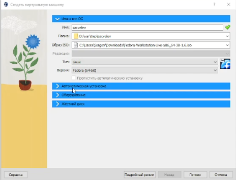

## Задаём тип и размер жёсткого диска

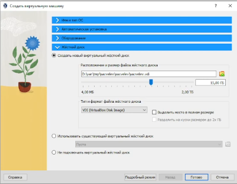

## Выбираем объём видеопамяти

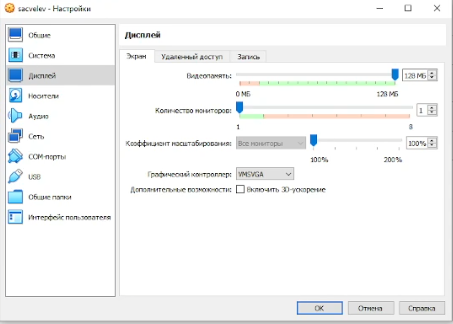

## Выбрали раскладку, часовой пояс и место установки

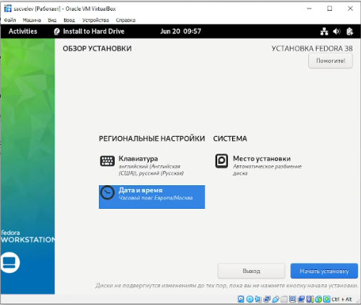(#fig:005 width=70%)

## Извлекаем образ диска ОС

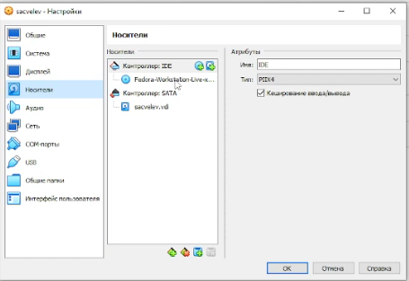(#fig:006 width=70%)

## Информация о пользователе

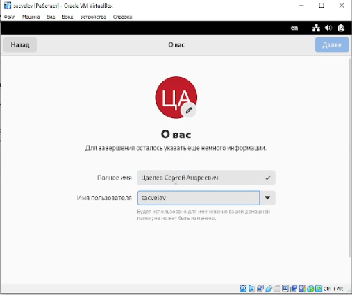(#fig:007 width=70%)

# Выполнение домашнего задания

## Результат выполнения команды dmesg

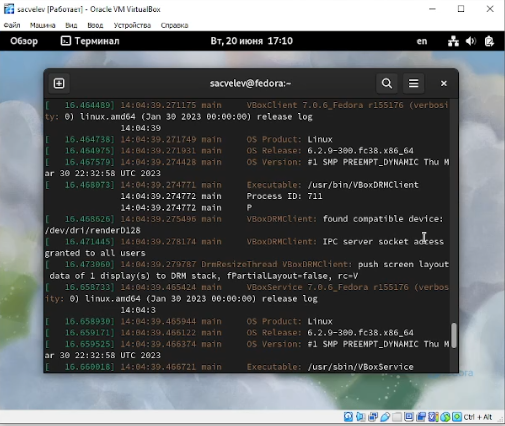(#fig:008 width=70%)

## Версия ядра Linux

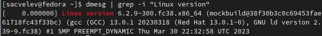(#fig:009 width=70%)

## Частота процессора

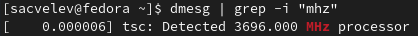(#fig:010 width=70%)

## Модель процессора

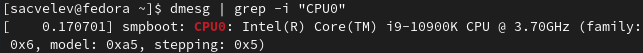(#fig:011 width=70%)

## Объём доступный оперативной памяти

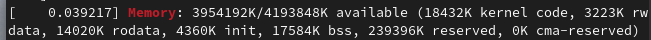(#fig:012 width=70%)

## Тип обнаруженного гипервизора

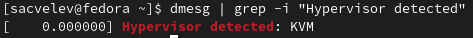(#fig:013 width=70%)

## Последовательность монтирования файловых систем

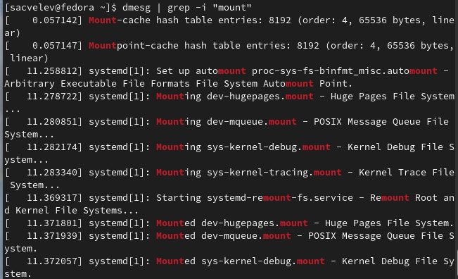(#fig:014 width=70%)

# Вывод

Я приобрёл практические навыки установки и настройки ОС на виртуальную машину.
