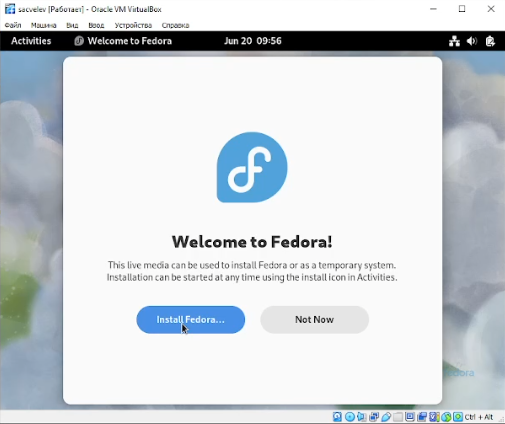

---
## Front matter
title: "Отчёт по лабораторной работе 1"
subtitle: "Установка и конфигурация операционной системы на виртуальную машину"
author: "Цвелев Сергей Андреевич"

## Generic otions
lang: ru-RU
toc-title: "Содержание"

## Bibliography
bibliography: bib/cite.bib
csl: pandoc/csl/gost-r-7-0-5-2008-numeric.csl

## Pdf output format
toc: true # Table of contents
toc-depth: 2
lof: true # List of figures
lot: true # List of tables
fontsize: 12pt
linestretch: 1.5
papersize: a4
documentclass: scrreprt
## I18n polyglossia
polyglossia-lang:
  name: russian
  options:
	- spelling=modern
	- babelshorthands=true
polyglossia-otherlangs:
  name: english
## I18n babel
babel-lang: russian
babel-otherlangs: english
## Fonts
mainfont: PT Serif
romanfont: PT Serif
sansfont: PT Sans
monofont: PT Mono
mainfontoptions: Ligatures=TeX
romanfontoptions: Ligatures=TeX
sansfontoptions: Ligatures=TeX,Scale=MatchLowercase
monofontoptions: Scale=MatchLowercase,Scale=0.9
## Biblatex
biblatex: true
biblio-style: "gost-numeric"
biblatexoptions:
  - parentracker=true
  - backend=biber
  - hyperref=auto
  - language=auto
  - autolang=other*
  - citestyle=gost-numeric
## Pandoc-crossref LaTeX customization
figureTitle: "Рис."
tableTitle: "Таблица"
listingTitle: "Листинг"
lofTitle: "Список иллюстраций"
lotTitle: "Список таблиц"
lolTitle: "Листинги"
## Misc options
indent: true
header-includes:
  - \usepackage{indentfirst}
  - \usepackage{float} # keep figures where there are in the text
  - \floatplacement{figure}{H} # keep figures where there are in the text
---

# Цель работы

Целью данной работы является приобретение практических навыков установки операционной системы на виртуальную машину, настройки минимально необходимых для дальнейшей работы сервисов.

# Выполнение лабораторной работы

Для выполнения лабораторной работы мы скачиваем и устанавливаем VirtualBox. Затем, в самой программе мы нажимаем кнопку “создать” и задаём расположение виртуальной машины, также выбрав файл образа операционной системы (рис. @fig:001). Там же мы задаём объём оперативной памяти (4096 мб) и создаём жёсткий диск (тип VDI, объём 80 ГБ) (рис. @fig:002).

(#fig:001 width=70%) 

(#fig:002 width=70%)

Заходим в настройки виртуальной машины и задаём объём видеопамяти (128 МБ) (рис. @fig:003)

(#fig:003 width=70%)

Запускаем машину. Устанавливаем на жёсткий диск (рис. @fig:004). Выбираем язык, раскладку, часовой пояс  место установки ОС (рис. @fig:005).

(#fig:004 width=70%)

(#fig:005 width=70%)

После идёт процесс установки. По его окончанию выключаем виртуальную машину и извлекаем образ ОС (рис. @fig:006). Мною при выполнении была допущена ошибка, когда я просто удалил дисковод. К счастью, никаких последствий это не возымело.

(#fig:006 width=70%)

Завершаем установку операционной системы. Вновь запускаем виртуальную машину и переходим к финальному этапу установки. Выбираем имя пользователя (рис. @fig:007) и пароль.

(#fig:007 width=70%)

На этом установка операционной системы на виртуальную машину была завершена.

# Выполнение домашнего задания

Открываем терминал, вводим команду dmesg, которая показывает последовательность запуска операционной системы(рис. @fig:008).

(#fig:008 width=70%)

В задании требуется найти следующую информацию (для точного поиска использовалась команда dmesg | grep -i “запрос”):
Версия ядра Linux:

Частота процессора:

Модель процессора:

Объём доступной оперативной памяти:

Тип обнаруженного гипервизора:

Тип файловой системы корневого раздела (не смог найти)

Последовательность монтирования файловых систем:

(#fig:009 width=70%)

(#fig:010 width=70%)

(#fig:011 width=70%)

(#fig:012 width=70%)

(#fig:013 width=70%)

(#fig:014 width=70%)

# Ответы на контрольные вопросы

Какую информацию содержит учётная запись пользователя?
Имя пользователя, идентификатор его и группы, пароль, полное имя, домашний каталог

Укажите команды терминала и приведите примеры:
для получения справки по команде: man (man cd, man ls, man mkdir и т.д.);
для перемещения по файловой системе: cd (cd /var/tmp);
для просмотра содержимого каталога: ls (ls /var/tmp);
для определения объёма каталога: du (du /var/tmp);
для создания / удаления каталогов / файлов: mk/mkdir - создание, rm/rmdir - удаление (mkdir /var/tmp/sacvelev);
для задания определённых прав на файл / каталог: chmod ;
для просмотра истории команд: history.

Что такое файловая система? Приведите примеры с краткой характеристикой.
Порядок, определяющий способ организации, хранения и именования данных на носителях информации в компьютерах, а также в другом электронном оборудовании. Примеры: EFS, ext, ext2

Как посмотреть, какие файловые системы подмонтированы в ОС?
Команда findmnt

Как удалить зависший процесс?
Команда kill “PID процесса”

# Выводы

Я приобрёл практические навыки установки и настройки ОС на виртуальную машину.

